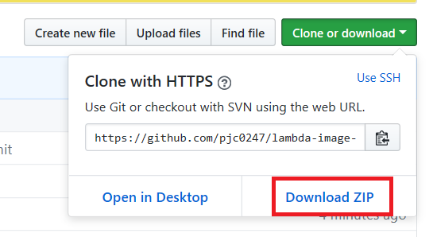

AWS.Lambda thumbnail generator
====

Ready-to-go thumbnail generator. 
 
Uses `sharp` image library which is significantly faster than `image-magick`. 
(http://sharp.pixelplumbing.com/en/stable/performance/#results)

Setup
----

 

I also included the `npm_modules` directory. So you can download the whole repository by `.zip` and use it directly.
